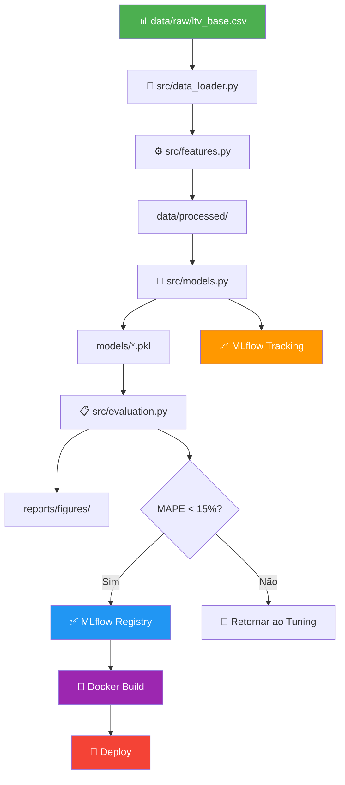

# 🎯 Arquitetura & Plano Técnico — Hashtag LTV Prediction

> Pipeline MLOps end-to-end para previsão de Lifetime Value, seguindo **CRISP-DM** com DVC, MLflow, DagsHub, Docker, testes e CI/CD.

---

## ✅ Estrutura de Pastas (Criada)

```
hashtag-ltv-prediction/
├── .github/workflows/          # CI/CD (GitHub Actions)
│   └── .gitkeep
├── config/
│   └── config.yaml             # Configuração centralizada do projeto
├── data/
│   ├── raw/
│   │   └── ltv_base.csv        # ✅ Movido da raiz
│   ├── processed/              # Dados após feature engineering
│   └── final/                  # Datasets prontos para modelagem
├── docs/                       # Documentação complementar
├── models/                     # Modelos serializados (.pkl/.joblib)
├── notebooks/
│   ├── clean/                  # Notebooks versionados (CRISP-DM)
│   │   ├── 01_business_and_data_understanding.ipynb
│   │   ├── 02_eda_and_feature_engineering.ipynb
│   │   ├── 03_baseline_and_advanced_modeling.ipynb
│   │   └── 04_model_evaluation_and_business_rules.ipynb
│   └── history_runs/           # Histórico de execuções experimentais
├── reports/
│   └── figures/                # Gráficos e visualizações
├── src/                        # Pipeline de ML (código modular)
│   ├── __init__.py
│   ├── data_loader.py          # Ingestão, validação, split
│   ├── features.py             # Feature engineering (RFM, temporal)
│   ├── models.py               # Treinamento, tuning, serialização
│   └── evaluation.py           # Métricas, plots, relatórios
├── tests/
│   └── __init__.py
├── .gitignore                  # Python + CSV/PKL + MLflow + DVC
├── README.md                   # Documentação do projeto
└── requirements.txt            # Dependências pinadas
```

---

## 🔬 Fases CRISP-DM — Plano de Execução

### Fase 1: Business & Data Understanding
| Item | Detalhe |
|---|---|
| **Notebook** | `01_business_and_data_understanding.ipynb` |
| **Módulo** | `src/data_loader.py` |
| **Ações** | Carregar `ltv_base.csv`, inspecionar schema, documentar dicionário de dados, validar qualidade (nulls, duplicatas, outliers), definir formulação da variável-alvo LTV |
| **Saída** | Dicionário de dados documentado, relatório de qualidade |

### Fase 2: Data Preparation & EDA
| Item | Detalhe |
|---|---|
| **Notebook** | `02_eda_and_feature_engineering.ipynb` |
| **Módulo** | `src/features.py` |
| **Ações** | EDA completa (distribuições, correlações, segmentações), criar features RFM, temporais e de interação, tratar outliers/missings, encoding categórico, salvar em `data/processed/` |
| **Saída** | Dataset processado, gráficos em `reports/figures/` |

### Fase 3: Modeling
| Item | Detalhe |
|---|---|
| **Notebook** | `03_baseline_and_advanced_modeling.ipynb` |
| **Módulo** | `src/models.py` |
| **Ações** | Treinar baseline (Ridge), treinar XGBoost/LightGBM/CatBoost, tuning com Optuna (100 trials, 5-fold CV), logar experimentos no MLflow, comparar performance |
| **Saída** | Modelos serializados em `models/`, runs no MLflow |

### Fase 4: Evaluation & Business Rules
| Item | Detalhe |
|---|---|
| **Notebook** | `04_model_evaluation_and_business_rules.ipynb` |
| **Módulo** | `src/evaluation.py` |
| **Ações** | Avaliar modelo campeão (MAE, RMSE, MAPE < 15%, R²), análise de resíduos, aplicar regras de negócio, segmentação por faixa de LTV, decisão GO/NO-GO |
| **Saída** | Relatório final, modelo registrado no MLflow Model Registry |

---

## 🛠️ Plano de Integração MLOps

### DVC (Data Version Control)
```yaml
# Arquivos a rastrear:
- data/raw/ltv_base.csv          # dvc add
- data/processed/*.parquet       # dvc add
- models/*.pkl                   # dvc add

# Remote:
remote: dagshub-storage
url: https://dagshub.com/<user>/<repo>.dvc
```

### MLflow (Experiment Tracking)
```yaml
tracking_uri: https://dagshub.com/<user>/<repo>.mlflow
experiment: hashtag-ltv-experiment
registry: hashtag-ltv-model

# Logging por run:
- Hiperparâmetros
- Métricas (MAE, RMSE, MAPE, R²)
- Artefatos (modelo, feature importance, plots)
- Tags (fase CRISP-DM, tipo de modelo)
```

### DagsHub (Hub Central)
- **Repositório Git** → código versionado
- **DVC Remote** → dados e modelos versionados
- **MLflow Server** → tracking de experimentos
- **Comparação de experimentos** via UI integrada

### Docker
```dockerfile
# Planejamento do Dockerfile:
FROM python:3.11-slim
WORKDIR /app
COPY requirements.txt .
RUN pip install --no-cache-dir -r requirements.txt
COPY src/ ./src/
COPY config/ ./config/
COPY models/ ./models/
EXPOSE 8000
CMD ["python", "-m", "src.serve"]   # API de predição (futuro)
```

### CI/CD (GitHub Actions)
```yaml
# .github/workflows/ci.yml (planejado):
on: [push, pull_request]
jobs:
  test:
    - Lint (flake8, black --check, isort --check)
    - Testes unitários (pytest --cov=src)
    - Validação de schema de dados
  train:  # Trigger manual ou merge em main
    - dvc repro
    - MLflow log
    - Registrar modelo se MAPE < threshold
```

### Testes (pytest)
```
tests/
├── __init__.py
├── test_data_loader.py      # Schema, tipos, ranges
├── test_features.py         # Transformações, dimensionalidade
├── test_models.py           # Treinamento em subset, serialização
└── test_evaluation.py       # Métricas com valores conhecidos
```

---

## 📦 Stack Completa

| Camada | Ferramentas |
|---|---|
| **Linguagem** | Python 3.11+ |
| **Data Science** | pandas, numpy, scikit-learn, scipy |
| **Visualização** | matplotlib, seaborn, plotly |
| **ML Models** | XGBoost, LightGBM, CatBoost |
| **Tuning** | Optuna |
| **Tracking** | MLflow (via DagsHub) |
| **Data Versioning** | DVC (remote DagsHub S3) |
| **Hub** | DagsHub |
| **CI/CD** | GitHub Actions |
| **Container** | Docker |
| **Testes** | pytest + pytest-cov |
| **Code Quality** | black, isort, flake8 |
| **Config** | YAML centralizado |

---

## 🔄 Workflow Completo (Diagrama)



---

## ⚠️ Open Questions

> [!IMPORTANT]
> Antes de iniciar a execução, confirme:
> 1. **DagsHub**: Já possui conta/repo no DagsHub? Se sim, qual o URL para configurar MLflow + DVC?
> 2. **Variável-alvo**: O LTV já está calculado no CSV ou precisa ser derivado (ex: soma de compras em janela temporal)?
> 3. **Escopo de Deploy**: O modelo será servido como API (FastAPI) ou apenas entregue como artefato para consumo interno?
> 4. **Python**: Qual versão do Python está instalada? (recomendado 3.11+)

---

## ✅ Checklist de Criação (Concluído)

- [x] Pastas: `.github/workflows/`, `config/`, `data/raw/`, `data/processed/`, `data/final/`, `docs/`, `models/`, `notebooks/clean/`, `notebooks/history_runs/`, `reports/figures/`, `src/`, `tests/`
- [x] Dados: `ltv_base.csv` movido para `data/raw/`
- [x] Módulos: `__init__.py`, `data_loader.py`, `features.py`, `models.py`, `evaluation.py` com docstrings e stubs
- [x] Config: `config.yaml` com todas as seções (paths, split, features, training, evaluation, MLflow, DVC, Docker)
- [x] Raiz: `.gitignore` (Python + CSV/PKL), `README.md`, `requirements.txt`
- [x] Notebooks: 4 notebooks CRISP-DM vazios com headers em `notebooks/clean/`
- [x] Gitkeep: Placeholders em diretórios vazios
